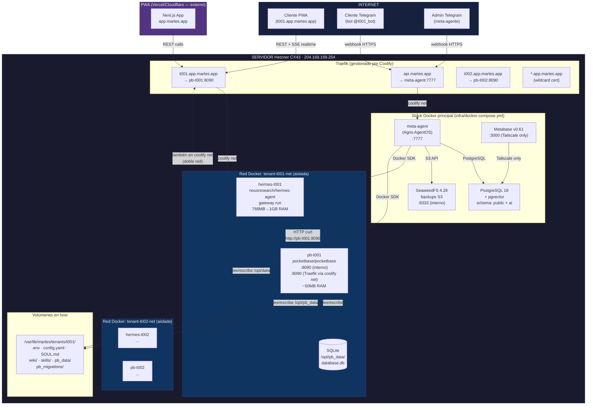

# Arquitectura completa: PocketBase + Hermes multi-tenant

> **Tipo**: documento de arquitectura + análisis técnico pre-implementación  
> **Fuentes**: NousResearch/hermes-agent (source code directo), PocketBase docs oficiales, análisis del stack actual  
> **Fecha**: junio 2026

---

## 1. El sistema completo — diagrama



---

## 2. Cómo PocketBase se conecta a ambas redes sin conflicto

### El truco de la doble red en Docker

```yaml
# En create_tenant() — configuración del container pb-t001:
networks:
  - tenant-t001-net    # ← red interna aislada: Hermes la usa para llamar pb-t001
  - coolify             # ← red de Traefik: permite que pb-t001 sea accesible externamente

# El container hermes-t001 solo está en tenant-t001-net (aislado)
# El container pb-t001 está en AMBAS redes
```

Esto es exactamente el mismo patrón que ya usa el meta-agente en el compose:
```yaml
# meta-agent ya hace esto:
networks:
  - default    # red del stack — PostgreSQL
  - coolify    # red de Traefik — api.martes.app
```

No hay conflicto con el Traefik actual. Traefik descubre containers nuevos automáticamente cuando ve el label `traefik.enable=true`.

### Verificación de conflictos con lo que ya existe

| Ruta actual | Nuevo routing | ¿Conflicto? |
|---|---|---|
| `api.martes.app` → meta-agent | `t001.app.martes.app` → pb-t001 | ❌ No — dominio diferente |
| Webhooks de Telegram | PocketBase REST API | ❌ No — rutas diferentes |
| `meta-agent` en red `coolify` | `pb-t001` en red `coolify` | ❌ No — dos containers coexisten |
| SeaweedFS en red `default` | PocketBase en `tenant-t001-net` | ❌ No — redes completamente separadas |

**Único requisito nuevo**: DNS wildcard `*.app.martes.app → 204.168.169.254`.  
Configurar en el registrador de dominio. Una sola vez.

---

## 3. Pre-configuración de PocketBase — el flujo correcto

### Por qué hay que preconfigurar antes de arrancar

PocketBase inicia vacío. Si arrancamos el container sin configuración, el cliente ve un setup wizard en blanco. Necesitamos:
1. Crear el superusuario admin
2. Crear las colecciones del CRM
3. Crear el API token para Hermes

Esto se hace con el sistema de **migrations** de PocketBase — archivos JS que corren automáticamente al arrancar.

### La skill del meta-agente: `deploy_pocketbase_tenant`

```
Admin → meta-agente Telegram:
"despliega pocketbase para t001"
```

El meta-agente ejecuta `deploy_pocketbase_tenant("t001")`:

```python
def deploy_pocketbase_tenant(tenant_code: str) -> str:
    """Despliega y configura PocketBase para un tenant existente.
    
    Pasos:
    1. Crea directorio pb_data/ y pb_migrations/ en el volumen del tenant
    2. Escribe los archivos de migrations con el schema CRM
    3. Inicia el container pb-{tenant_code}
    4. Espera a que PocketBase esté healthy (30s)
    5. Crea el superadmin via CLI (--createDefaultAdmin)
    6. Genera API token para Hermes via PocketBase API
    7. Escribe POCKETBASE_TOKEN y POCKETBASE_URL en .env del tenant
    8. Reinicia hermes-{tenant_code} para que cargue las nuevas vars
    """
```

### Los archivos de migration que se copian al volumen

```
/var/lib/martes/tenants/t001/
  pb_migrations/
    1_crm_schema.js    ← crea todas las colecciones
    2_hermes_token.js  ← crea el API token de sistema
  pb_data/             ← vacío, PocketBase lo inicializa
```

**`1_crm_schema.js`** (migration que crea el CRM):

```javascript
// PocketBase migration — se ejecuta solo una vez al arrancar
migrate((app) => {
  // Colección: contactos (clientes del negocio)
  const contactos = new Collection({
    name: "contactos",
    type: "base",
    fields: [
      { name: "nombre",       type: "text",     required: true },
      { name: "whatsapp",     type: "text" },
      { name: "telegram_id",  type: "text" },
      { name: "email",        type: "email" },
      { name: "notas",        type: "editor" },
      { name: "tags",         type: "json" },
      { name: "ultimo_contacto", type: "date" },
    ]
  });
  app.save(contactos);

  // Colección: conversaciones (historial de mensajes)
  const conversaciones = new Collection({
    name: "conversaciones",
    type: "base",
    fields: [
      { name: "contacto",    type: "relation", collectionId: contactos.id },
      { name: "canal",       type: "select", values: ["whatsapp","telegram","email","otro"] },
      { name: "mensaje",     type: "text",    required: true },
      { name: "direccion",   type: "select", values: ["entrante","saliente"] },
      { name: "procesado",   type: "bool",    default: false },
    ]
  });
  app.save(conversaciones);

  // Colección: productos (inventario)
  const productos = new Collection({
    name: "productos",
    type: "base",
    fields: [
      { name: "nombre",      type: "text",    required: true },
      { name: "sku",         type: "text" },
      { name: "descripcion", type: "text" },
      { name: "stock",       type: "number",  default: 0 },
      { name: "precio_usd",  type: "number",  required: true },
      { name: "foto",        type: "file",    maxSelect: 3 },
      { name: "activo",      type: "bool",    default: true },
      { name: "variantes",   type: "json" },   // {talla: ["S","M","L"], color: ["negro","rojo"]}
    ]
  });
  app.save(productos);

  // Colección: pedidos
  const pedidos = new Collection({
    name: "pedidos",
    type: "base",
    fields: [
      { name: "contacto",     type: "relation", collectionId: contactos.id },
      { name: "items",        type: "json" },  // [{producto_id, variante, qty, precio}]
      { name: "total_usd",    type: "number",  required: true },
      { name: "estado",       type: "select", values: ["pendiente_pago","pagado","en_preparacion","enviado","entregado","cancelado"] },
      { name: "metodo_pago",  type: "select", values: ["pago_movil","usdt","zelle","efectivo","otro"] },
      { name: "referencia",   type: "text" },
      { name: "notas",        type: "text" },
      { name: "fecha_entrega",type: "date" },
    ]
  });
  app.save(pedidos);

  // Colección: pagos
  const pagos = new Collection({
    name: "pagos",
    type: "base",
    fields: [
      { name: "pedido",       type: "relation", collectionId: pedidos.id },
      { name: "monto_usd",    type: "number", required: true },
      { name: "metodo",       type: "select", values: ["pago_movil","usdt","zelle","efectivo","otro"] },
      { name: "referencia",   type: "text" },
      { name: "comprobante",  type: "file" },
      { name: "confirmado",   type: "bool", default: false },
    ]
  });
  app.save(pagos);

  // Colección: calendario (citas, entregas, recordatorios)
  const calendario = new Collection({
    name: "calendario",
    type: "base",
    fields: [
      { name: "titulo",       type: "text",  required: true },
      { name: "contacto",     type: "relation", collectionId: contactos.id },
      { name: "tipo",         type: "select", values: ["cita","entrega","llamada","recordatorio"] },
      { name: "inicio",       type: "date",  required: true },
      { name: "fin",          type: "date" },
      { name: "descripcion",  type: "text" },
      { name: "completado",   type: "bool",  default: false },
    ]
  });
  app.save(calendario);

  // Colección: configuracion (del negocio — una fila)
  const config_negocio = new Collection({
    name: "config_negocio",
    type: "base",
    fields: [
      { name: "nombre_negocio", type: "text" },
      { name: "logo",           type: "file", maxSelect: 1 },
      { name: "whatsapp",       type: "text" },
      { name: "pago_movil",     type: "text" },
      { name: "usdt_wallet",    type: "text" },
      { name: "zelle",          type: "text" },
      { name: "tipo_negocio",   type: "select", values: ["retail","servicios","restaurante","distribuidora","otro"] },
    ]
  });
  app.save(config_negocio);
});
```

---

## 4. Browser vs sin-browser — análisis técnico definitivo

### Cómo funciona `web_search` sin browser (del source code)

```
Backends de web_search en orden de prioridad (web_tools.py):
1. firecrawl    → API cloud (necesita FIRECRAWL_API_KEY)
2. parallel     → API cloud (necesita PARALLEL_API_KEY)
3. tavily       → API cloud (necesita TAVILY_API_KEY)
4. exa          → API cloud (necesita EXA_API_KEY)
5. searxng      → self-hosted (necesita SEARXNG_URL)
6. brave-free   → API free tier (necesita BRAVE_SEARCH_API_KEY)
7. ddgs         → DuckDuckGo (solo necesita que el package ddgs esté instalado)
```

**`ddgs` es el fallback gratuito sin API key y SIN browser.** Es un paquete Python que hace HTTP requests directos a DuckDuckGo. El Hermes v0.14.0 lo incluye por defecto.

### Qué necesita browser y qué no

| Tarea | ¿Necesita browser? | Backend alternativo |
|---|---|---|
| Buscar en internet | ❌ No | `ddgs` (gratis, sin key) |
| Obtener precio de BTC | ❌ No | Yahoo Finance skill |
| Leer el contenido de una URL | ⚠️ Para SPAs | `web_extract` via Firecrawl API |
| Llenar un formulario web | ✅ Sí | No hay alternativa |
| Tomar screenshot de una página | ✅ Sí | No hay alternativa |
| Navegar con login | ✅ Sí | MCP browser externo |
| Scraping de Instagram | ✅ Sí | MCP browser externo |
| Verificar disponibilidad de producto | ❌ No | HTTP request directo |

**Para el 80% de casos de uso de una PyME venezolana: no se necesita browser.**

### Browser local vs cloud vs MCP

```
OPCIÓN A: Browser local (Chromium headless)
  Instalar: npm install -g agent-browser && agent-browser install
  Descarga: ~200MB de Chromium binary
  RAM al usar: +300-500MB mientras está activo (proceso Chromium)
  RAM idle: +0MB (Chromium solo arranca cuando se necesita)
  Costo: $0 (open source)
  Problema: necesita espacio en disco + tiempo de instalación
             cap_drop=ALL puede bloquear algunas features de Chromium

OPCIÓN B: Browser cloud (Browserbase / Browser Use)
  No instala nada en el container
  RAM: +0MB en el container (todo corre en la nube del proveedor)
  Costo: $0.05-0.10 por minuto de sesión de browser
  Setup: BROWSERBASE_API_KEY o BROWSER_USE_API_KEY en .env
  Pro: sin restricciones de caps, sin RAM extra

OPCIÓN C: MCP browser (Playwright MCP server externo)
  Hermes llama al MCP server via HTTP/SSE
  El MCP server puede correr en otro container o servidor
  RAM en container Hermes: +5MB (solo el cliente HTTP)
  RAM total sistema: el MCP server usa ~300MB (en su propio container)
  Pro: separación total, Hermes no necesita Chromium
  Con: requiere desplegar y mantener el MCP server
```

### Recomendación por tier de servicio

```
Tier Básico (PyME sin automatización web):
  web_search = ddgs (gratis, no se instala nada extra)
  Sin browser → RAM limite 768MB suficiente
  ✅ 90% de casos de uso cubiertos

Tier Pro (con automatización web):
  web_search = Firecrawl API (mejor calidad, $20/mes)
  Browser = Browserbase cloud API (~$15-30/mes según uso)
  RAM container: sin cambio (todo es HTTP)
  ✅ 100% de casos de uso cubiertos

Tier Self-hosted Pro (browser local):
  web_search = ddgs + firecrawl
  Browser = Chromium local (agent-browser install)
  RAM limite: 1.5GB necesario para browser activo simultáneo
  ✅ Máximo control, mínimo costo externo
```

---

## 5. Análisis RAM — hasta dónde puede crecer un Hermes

### Mediciones del source code y benchmarks de la comunidad

```
COMPONENTE                        RAM IDLE    RAM ACTIVO    NOTAS
─────────────────────────────────────────────────────────────────
Hermes gateway (Python process)    150MB       200MB         siempre activo
  └ uv Python runtime:             +20MB                     
  └ dependencias pip instaladas:   +50-100MB   según skills
  └ historial de sesión en mem:    +10-30MB    según conversación larga

web_search (ddgs, libre):          +0MB        +5MB          HTTP puro
web_search (Firecrawl API):        +0MB        +5MB          HTTP puro
web_extract (URL → texto):         +0MB        +10MB         HTTP puro

Browser local (Chromium headless):
  └ chromium process idle:         +0MB        —             no arranca idle
  └ chromium al navegar:           —           +350-500MB    1 tab activo
  └ chromium con 3+ tabs:          —           +700MB+       multipage tasks

TTS (Edge TTS, default, gratis):   +0MB        +10MB         HTTP puro
TTS (OpenAI TTS):                  +0MB        +10MB         HTTP puro
TTS (NeuTTS local):                +150MB      +200MB        modelo en RAM
TTS (ElevenLabs):                  +0MB        +10MB         HTTP puro

Transcripción voz (Whisper local): +500MB      +600MB        modelo en RAM
Transcripción (Groq API):          +0MB        +5MB          HTTP puro

MCP server externo (HTTP/SSE):     +0MB        +5MB          HTTP puro
MCP server local (stdio):          +50MB       +80MB         proceso hijo
  └ MCP Playwright (local):        +100MB      +350MB        Chromium incluido

Kanban / subagentes:
  └ 1 subagente worker:            +150MB      +200MB        Python process fork
  └ 2 subagentes paralelos:        +300MB      +400MB
  └ 5 subagentes (max práctico):   +750MB      +1,000MB

Generación imágenes (FAL.ai):      +0MB        +10MB         HTTP puro
Computer use (screenshot+click):   depende del browser backend

PocketBase sidecar (en su container aparte):
  └ PocketBase idle:               +30MB       —             
  └ PocketBase con 10 req/s:       —           +80MB
  └ PocketBase con realtime SSE:   —           +100-150MB
```

### Presupuesto de RAM por configuración real

```
──────────────────────────────────────────────────────────────────
CONFIGURACIÓN: "Hermes básico para PyME venezolana"
  Gateway + ddgs web search + TTS Edge + MCP remoto (2)
  Actividades: responder WhatsApp, buscar precios, tomar pedidos

  Componente                 Idle     Peak
  Gateway base:              200MB    250MB
  web_search ddgs:           +0MB     +5MB
  TTS Edge HTTP:             +0MB     +10MB
  2× MCP remoto HTTP:        +0MB     +10MB
  ─────────────────────────────────────
  TOTAL:                     200MB    275MB

  → Límite actual 768MB: 2.7× headroom ✅ perfecto
  → pids_limit 256: suficiente ✅
  → tmpfs /tmp 100MB: suficiente ✅

──────────────────────────────────────────────────────────────────
CONFIGURACIÓN: "Hermes Pro con browser cloud y multiagente"
  Gateway + Firecrawl + Browser cloud (Browserbase) + 2 kanban workers

  Componente                 Idle     Peak
  Gateway base:              200MB    250MB
  web_search Firecrawl HTTP: +0MB     +5MB
  Browser cloud HTTP:        +0MB     +10MB
  2× kanban workers fork:    +0MB     +400MB
  Skills pip instaladas:     +80MB    +80MB
  ─────────────────────────────────────
  TOTAL:                     280MB    745MB

  → Límite actual 768MB: JUSTO ⚠️ (745MB peak ≈ 768MB límite)
  → Recomendado subir a 1GB ✅
  → pids_limit 256: necesita 512 (kanban crea procesos) ⚠️

──────────────────────────────────────────────────────────────────
CONFIGURACIÓN: "Hermes Heavy — browser local + multi-agente"
  Gateway + Chromium local + 3 kanban workers + 2 MCP locales

  Componente                 Idle     Peak
  Gateway base:              200MB    250MB
  Chromium local:            +0MB     +450MB (cuando activo)
  3× kanban workers:         +0MB     +600MB
  2× MCP local stdio:        +100MB   +160MB
  Skills pesadas:            +100MB   +100MB
  ─────────────────────────────────────
  TOTAL:                     400MB    1,560MB

  → Límite actual 768MB: INSUFICIENTE ❌
  → Necesita 2GB para operar sin riesgo
  → pids_limit 256: INSUFICIENTE ❌ (1 agente Python = ~20 PIDs)

──────────────────────────────────────────────────────────────────
```

### La tabla de tiers correcta

| Tier | RAM | CPU | pids | tmpfs | Precio | Perfil |
|---|---|---|---|---|---|---|
| **Básico** | 768MB | 0.75 | 512 | 500MB | $30/mes | PyME sin browser, solo HTTP tools |
| **Pro** | 1.2GB | 1.0 | 512 | 1GB | $50/mes | Browser cloud + multiagente básico |
| **Heavy** | 2GB | 1.5 | 1024 | 2GB | $80/mes | Browser local + kanban multi-agente |

**Cambios mínimos necesarios ahora** (sin cambiar la lógica de tiers):
- `pids_limit`: 256 → **512** (todos los tiers — kanban necesita esto)
- `tmpfs /tmp`: 100MB → **500MB** (todos — pip installs, downloads)
- `mem_limit`: mantener 768MB para el tier actual

---

## 6. El flujo de instalación de skills desde Telegram

### Lo que el cliente puede hacer y lo que no

El problema actual: cuando el cliente dice "instala la skill de Airtable", el bot responde que no puede.

**Por qué**: `hermes skills install` es un comando CLI que:
1. Descarga la skill desde GitHub
2. La copia a `/opt/data/skills/`
3. En algunos casos instala dependencias pip

El gateway está corriendo como proceso principal. No puede ejecutar `hermes skills install` sin matar el gateway primero.

**La solución correcta**: las skills se instalan **desde el meta-agente** (el administrador), no desde el bot del cliente.

```
Admin → meta-agente:
"instala la skill de Airtable en t001"

Meta-agente:
1. Descarga el SKILL.md de Airtable del repo de Hermes
2. Lo copia a /var/lib/martes/tenants/t001/skills/airtable/SKILL.md
3. Reinicia hermes-t001 para que cargue la skill
4. Confirma: "Skill Airtable instalada en t001"
```

El cliente **SÍ puede** hacer estas cosas desde su bot (no requieren reinstalar):
- Actualizar el catálogo (modifica archivos en /opt/data/)
- Cambiar config.yaml (modifica archivo)
- Agregar entradas en su wiki
- Modificar SOUL.md
- Crear automatizaciones (cron — modifica su cron store)

**Lo que no puede hacer** (requiere meta-agente):
- Instalar skills nuevas (requiere reiniciar el gateway)
- Cambiar el modelo base (requiere configuración de .env)
- Instalar browser tools (requiere npm install en el container)
- Reiniciarse (mataría su propio proceso)

### El skill del meta-agente para instalar skills en tenants

```python
def install_skill_in_tenant(tenant_code: str, skill_name: str) -> str:
    """Instala una skill en el tenant sin reiniciar el gateway innecesariamente.
    
    1. Descarga SKILL.md desde el repo oficial de Hermes o skills.sh
    2. Copia al volumen del tenant: /var/lib/martes/tenants/{code}/skills/{skill}/
    3. Reinicia hermes-{code} para que cargue la nueva skill
    4. Verifica que el bot responde normalmente
    """
```

---

## 7. Qué hay que crear — lista completa

### Capa 1: Infraestructura (cambios en create_tenant + docker-compose)

```
✅ Ya existe:
  - create_tenant() crea hermes-{code} container
  - Volúmenes en /var/lib/martes/tenants/{code}/
  - Red aislada tenant-{code}-net
  - Traefik routing para api.martes.app

❌ Falta crear:
  1. Container pb-{code} sidecar en create_tenant()
     - Image: ghcr.io/pocketbase/pocketbase:latest
     - Redes: tenant-{code}-net + coolify (doble red)
     - Labels Traefik: {code}.app.martes.app → :8090
     - Volumen: /var/lib/martes/tenants/{code}/pb_data:/pb_data

  2. Migration files copiados al volumen ANTES de arrancar PocketBase
     - /var/lib/martes/tenants/{code}/pb_migrations/1_crm_schema.js
     - /var/lib/martes/tenants/{code}/pb_migrations/2_hermes_token.js

  3. DNS wildcard *.app.martes.app → 204.168.169.254

  4. Crear superadmin PocketBase via CLI en create_tenant():
     docker exec pb-{code} /pb/pocketbase superuser create admin@martes.app {RANDOM_PASS}
  
  5. Generar API token para Hermes y guardarlo en .env del tenant

  6. delete_tenant() debe también parar/eliminar pb-{code}
```

### Capa 2: PWA (frontend — trabajo de desarrollo web)

```
❌ Falta crear (trabajo externo, no en este repo):
  - Next.js app en Vercel
  - Login con PocketBase (email/OTP)
  - Dashboard principal (inventario, pedidos, conversaciones)
  - Realtime subscriptions (SSE de PocketBase)
  - Mobile PWA (installable en Android/iOS)
  - Página pública de configuración (cambiar nombre del negocio, logo, métodos de pago)
```

### Capa 3: Hermes skills para el CRM (skills del agente)

```
❌ Falta crear:
  - /opt/data/skills/crm-pocketbase/SKILL.md
    Enseña a Hermes cómo:
    - Guardar conversaciones de WhatsApp/Telegram automáticamente
    - Crear contactos nuevos cuando el cliente no existe
    - Registrar pedidos desde el chat
    - Actualizar inventario cuando confirma pedido
    - Crear eventos en calendario cuando agenda cita
```

### Capa 4: Meta-agente tools nuevas

```
❌ Falta implementar:
  - deploy_pocketbase_tenant(tenant_code) — crea pb-{code} + configura
  - install_skill_in_tenant(tenant_code, skill_name) — instala skill sin el CLI
  - update_tenant_pocketbase_schema(tenant_code) — actualiza colecciones
  - get_tenant_pocketbase_token(tenant_code) — devuelve el API token
```

---

## 8. Traefik — verificación de conflictos en detalle

### Cómo Traefik descubre containers en Coolify

Traefik usa Docker provider: descubre automáticamente containers con `traefik.enable=true` en la red `coolify`.

**El meta-agente actual**:
```yaml
labels:
  traefik.enable: "true"
  traefik.docker.network: "coolify"
  traefik.http.routers.meta-agent-https.rule: "Host(`api.martes.app`)"
```

**Cada PocketBase tendrá**:
```yaml
labels:
  traefik.enable: "true"
  traefik.docker.network: "coolify"
  traefik.http.routers.pb-t001-https.rule: "Host(`t001.app.martes.app`)"
  traefik.http.routers.pb-t001-https.tls.certresolver: "letsencrypt"
  traefik.http.services.pb-t001.loadbalancer.server.port: "8090"
```

**¿Hay conflicto?** No. Las reglas de Traefik son por hostname. `api.martes.app` y `t001.app.martes.app` son hostnames distintos. Traefik tiene un router por cada uno. Cada router va a un servicio distinto.

### El certificado TLS

Traefik solicita certificados Let's Encrypt automáticamente cuando ve un nuevo hostname. Para `t001.app.martes.app` solicitará un cert. Para wildcard `*.app.martes.app` también puede solicitarlo (con DNS challenge).

**Recomendación**: wildcard cert para `*.app.martes.app` — se solicita una vez, cubre todos los tenants.

```yaml
# En Traefik config (ya existente en Coolify):
certificatesResolvers:
  letsencrypt:
    acme:
      dnsChallenge:  # necesario para wildcard
        provider: cloudflare  # o el DNS provider que uses
```

Si el dominio está en Cloudflare, añadir `CF_DNS_API_TOKEN` al entorno de Traefik. Coolify lo gestiona desde su UI.

---

## 9. Decisiones de diseño finales

### ¿Por container separado o proceso dentro del container de Hermes?

**Opción A: Container separado `pb-{code}`** (recomendada):
- Si PocketBase crashea, Hermes sigue respondiendo
- Si Hermes crashea, los datos en PocketBase siguen accesibles para la PWA
- Cada uno se puede reiniciar independientemente
- Más fácil de debuggear

**Opción B: PocketBase como proceso en el mismo container**:
- Más simple en create_tenant
- Pero requiere supervisor de procesos (supervisord o tini)
- Si Hermes crashea y se reinicia, PocketBase también se reinicia
- Complica el manejo de permisos y PIDs

**Decisión**: container separado.

### ¿Coolify puede gestionar los containers de PocketBase?

No directamente — Coolify gestiona el stack definido en `docker-compose.yml`. Los containers de tenants (hermes-t001, pb-t001) son creados por el meta-agente via Docker SDK, fuera del control de Coolify.

Esto es correcto y ya es el patrón actual para hermes-t001. Coolify gestiona el meta-agente; el meta-agente gestiona los containers de tenants.

Para monitorizarlo: los containers `pb-{code}` aparecen en `docker ps` del servidor. El Diagnosticador puede listarlos. Metabase puede ver el estado de los tenants en la DB.

### Resumen de pros y contras totales

| Aspecto | Pro | Contra |
|---|---|---|
| **Aislamiento** | Datos completamente separados por tenant | Más containers |
| **Realtime PWA** | SSE nativo, sin Redis | — |
| **Auth** | Built-in OAuth2/OTP sin Clerk | — |
| **RAM** | +50MB idle (mínimo) | Reduce capacidad de tenants |
| **Despliegue** | Automatizado en create_tenant | Doble red Docker (pero ya es el patrón) |
| **Traefik** | Sin conflictos, discovery automático | DNS wildcard requerido |
| **Browser** | Cloud providers = 0MB extra, no afecta límites | Costo adicional para browser cloud |
| **Skills** | Se instalan vía meta-agente, no el gateway | El cliente no puede instalar skills directo |
| **Escalado** | Cada tenant se puede mover a otro servidor | Sin cluster horizontal |
| **Mantenibilidad** | Un SQLite por tenant = backup simple | N×2 containers en el servidor |
